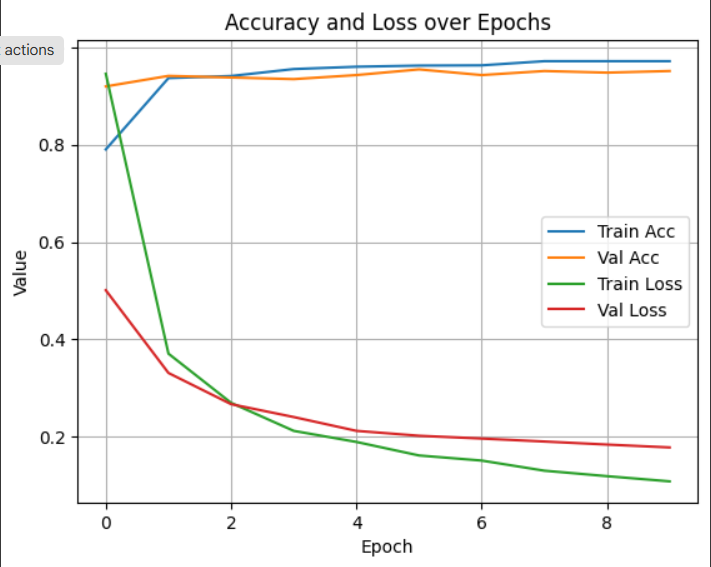

# Species Identification App

An intelligent Streamlit app that identifies species from images or text input using a combination of local models, APIs (Pl\@ntNet, HuggingFace, iNaturalist, GBIF), and Wikipedia enrichment. It predicts the species category, provides scientific information, taxonomy, synonyms, habitats, and more — all in one place!

---

## 🚀 Features

* Image-based species identification using deep learning and APIs
* Local PyTorch model to predict broad categories (Bird, Plant, etc.)
* Uses HuggingFace models for birds and other animals
* Uses Pl\@ntNet API for plant recognition
* Auto-maps common/scientific names using iNaturalist
* Fetches detailed species data from GBIF (taxonomy, region, synonyms)
* Adds description, images, and structured info from Wikipedia
* Caches results in local SQLite DB to avoid repeated API calls

---

## 🧑‍💻 Technologies Used

| Area      | Tools/Packages                            |
| --------- | ----------------------------------------- |
| Interface | [Streamlit](https://streamlit.io)         |
| ML Models | PyTorch Model, HuggingFace Transformers |
| APIs      | Pl\@ntNet, iNaturalist, GBIF, Wikipedia   |
| DB        | SQLite                                    |
| Others    | Python, dotenv, PIL, Requests             |

---

## 🛠️ Setup Instructions

### 1. Clone the Repository

```bash
git clone https://github.com/karnesh7/species-info-app.git
cd species-info-app
```

### 2. Install Dependencies

Make sure you're using Python 3.8–3.11.

```bash
pip install -r requirements.txt
```

### 3. Add Environment Variables

Create a `.env` file in the root directory and add:

```
PLANTNET_API_KEY=your_plantnet_api_key_here
HF_TOKEN=your_huggingface_token_here
```

### 4. Run the App

```bash
streamlit run app.py
```

---

## 📁 Project Structure

```
species-id-app/
│
├── app.py                        Main Streamlit app
├── requirements.txt              Dependencies
├── .env                          API keys (excluded from Git)
├── models/                       PyTorch model + HF cache
├── db/                           SQLite cache
├── tests/                        (Optional) Unit tests
├── services/
│   ├── api_huggingface.py        HF image classification
│   ├── api_plantnet.py           Pl@ntNet identification
│   ├── api_gbif.py               GBIF taxonomy data
│   ├── api_inaturalist.py        Name mapping
│   ├── api_wikipedia.py          Wikipedia enrichment
│   ├── db_handler.py             SQLite cache handlers
│   └── local_classifier.py       PyTorch category classifier
```

---

## 🧠 Local Classifier Details

The broad category classifier (Bird, Plant, Fish, etc.) is a lightweight PyTorch model trained to route images to the appropriate downstream pipeline.

### 🏷️ Categories  
- `Bird`, `Fish`, `Insect`, `Mammal`, `Plant`, `Reptile_Amphibian`

### 🏗️ Architecture  
- Based on a pretrained **EfficientNet-B0**
- Fine-tuned on a curated dataset of ~3,000 images  
- Exported as a PyTorch `.pt` model for fast and reliable inference

### 📊 Training Metrics  
| Metric         | Value (Final Epoch) |
|----------------|---------------------|
| Train Accuracy | ~98%                |
| Val Accuracy   | ~96%                |
| Train Loss     | 0.09                |
| Val Loss       | 0.18                |

### 📈 Accuracy & Loss Curves  

<p align="center">
  
</p>

### 🔁 Reproducibility  
You can retrain or fine-tune the classifier using the provided Colab notebook:  
📓 [Train Local Classifier on Google Colab](https://colab.research.google.com/github/karnesh7/species-info-app/blob/main/notebooks/train_classifier.ipynb)

---

## 🧪 Testing

You can add simple unit tests in the `tests/` directory.

To run them:

```bash
python -m unittest discover tests
```

---

## ⚠️ Disclaimer

* This app relies on public APIs and models, which may have usage limits or downtime.
* Always double-check results, especially for low-confidence predictions.

---

## 🧠 Future Improvements

* Add image preview and editing
* Improve UI (themes, tabs)
* Offline fallback mode
* Export results as PDF/CSV

---

## 🤝 Contributing

Pull requests are welcome! If you have suggestions, bug reports, or want to contribute features, feel free to open an issue or PR.

---

## 📄 License

[MIT](LICENSE)

---
